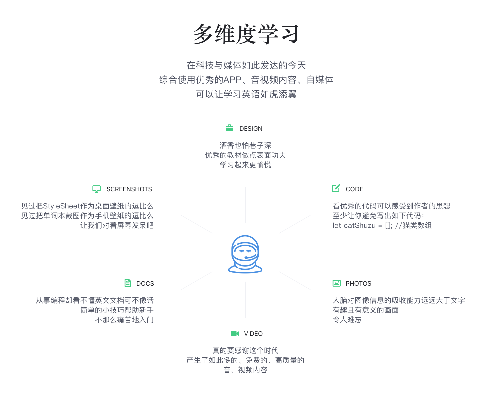

# English-level-up-tips-for-Chinese

## Gitbook链接

https://www.gitbook.com/read/book/byoungd/english-level-up-tips-for-chinese

## 英语水平等级

>本图主要参考 http://www.coe.int/en/web/common-european-framework-reference-languages/table-1-cefr-3.3-common-reference-levels-global-scale

## 特色

## 章节
### 已完成：

### 待完成：

方案篇是分别为学生党和在职人员量身定制的英语学习方案，如果不采用合适的学习计划，那么碎片时间能做的基本上只有提升词汇了。

这篇是正在写的，会尽快发布。

---

写作的要求很高，本人的写作水平并不自信，目前不敢妄言，恐误人子弟；
也不愿推荐几本语法书、写作书就草草了事，
我需要一些时间去慢慢完善这个章节。

这份单词表尽量涵盖时下流行的语言，目的是帮助你更方便的看英文文档。
工程巨大，需要较长的时间进行整理。

## 从哪里开始
- [认知篇](part-1/1-understanding.md)
- [单词篇](part-1/2-vocabulary.md)
- [听力篇](part-1/3-listening.md)
- [阅读篇](part-1/4-reading.md)
- [口语篇](part-1/5-speaking.md)
- [扯淡篇](part-2/x-misc.md)

## 感谢

- 感谢帮助完善这份指南的所有人

- 感谢每一位star/fork/PR/watch的朋友，真心希望本指南能给你带来一些小小的帮助

- 特别感谢: 

## 转载声明
转载本指南，请注明作者与本 repo 的 Github 链接，谢谢！

## 有疑问或建议
您可以直接在本 repo 提 issue

>也许有些放弃的人会这样想：
    背那么多单词真的有意义吗？
    也许差别不是那么大吧？
    很多单词在生活中根本就用不到吧？
    
   
    学习，难道不是人生最棒的乐趣么？
